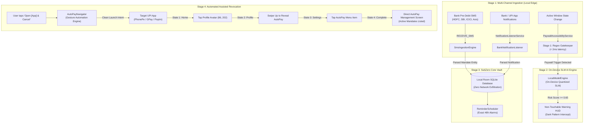

# SubZero (Mandate Guardian)
### Autonomous, Privacy-First UPI AutoPay Audit & Deceptive Trial Interception System

[-3DDC84?style=flat&logo=android&logoColor=white)](https://developer.android.com)
[](https://kotlinlang.org)
[](https://developer.android.com/jetpack/compose)
[](#zero-internet-privacy-architecture)
[](LICENSE)

---

## Executive Summary

Modern mobile ecosystems suffer from aggressive dark patterns: deceptive "3-day free trials" that silently convert into recurring ₹999/month subscriptions, buried mandate cancellation buttons, and multi-app fragmentation across PhonePe, Google Pay, Paytm, and BHIM. Users routinely discover unwanted recurring debits only weeks or months after bank clearing occurs.

**SubZero (Mandate Guardian)** is an on-device, autonomous watchdog that:
1. **Intercepts Deceptive Subscription Traps**: Evaluates paywall screens in real time using a 2-stage Local Small Language Model (SLM) inference engine before the user authorizes payment.
2. **Aggregates Multi-App UPI AutoPays**: Ingests statutory pre-debit bank SMS alerts and NPCI e-mandate notifications into a unified, consolidated mandate vault.
3. **Automates 1-Click Mandate Revocation**: Drives accessibility-assisted navigation directly into target UPI apps (PhonePe, Google Pay, Paytm, BHIM) to the exact AutoPay management screen, bypassing cryptic deep-link failures and eliminating floating overlay clutter.
4. **Guarantees Zero Data Exfiltration**: Built with **ZERO Internet Permission** (`android.permission.INTERNET` is omitted from the manifest), ensuring strict compliance with India's **Digital Personal Data Protection (DPDP) Act 2023**.

---

## Regulatory & Legal Compliance Framework

SubZero is engineered around Indian financial and data privacy statutory mandates:

```
                      ┌─────────────────────────────────────────┐
                      │      Indian Regulatory Landscape        │
                      └────────────────────┬────────────────────┘
                                           │
         ┌─────────────────────────────────┼─────────────────────────────────┐
         ▼                                 ▼                                 ▼
┌──────────────────┐             ┌──────────────────┐              ┌──────────────────┐
│  RBI e-Mandate   │             │  NPCI UPI AutoPay │              │  DPDP Act 2023   │
│ Master Direction │             │ Operating Rules  │              │ Privacy Mandate  │
└────────┬─────────┘             └────────┬─────────┘              └────────┬─────────┘
         │                                │                                 │
         ├─ AFA (2FA) on Creation         ├─ UMN (Unique Mandate Number)   ├─ Strict Purpose Limitation
         ├─ 24-48h Pre-Debit Notice       ├─ Merchant Debit Routing        ├─ Zero Network Transmission
         └─ Mandatory Direct Revoke       └─ Explicit Mandate Lifecycles   └─ Local Edge Isolation
```

### 1. RBI Master Direction – e-Mandates on Cards & UPI for Recurring Transactions
* **Statutory Requirement**: The Reserve Bank of India (RBI) mandates that issuers dispatch an **Additional Factor of Authentication (AFA)** during mandate creation and a pre-debit notification **at least 24 to 48 hours** prior to every actual charge.
* **Revocation Entitlement**: RBI regulations explicitly grant consumers the statutory right to withdraw/cancel e-mandates directly through their payment service provider or issuing bank without requiring merchant mediation.
* **SubZero Alignment**: `SmsIngestionEngine` intercepts and parses official bank pre-debit SMS alerts, calculating exact clearing lock-in windows and notifying the user 48 hours in advance.

### 2. NPCI UPI AutoPay Framework
* **Statutory Requirement**: Every recurring debit is assigned an immutable 32-character **Unique Mandate Number (UMN)**. Revocation must resolve directly against this UMN.
* **SubZero Alignment**: Ingests and links the UMN to the originating Payment Service Provider (PSP) package (`com.phonepe.app`, `com.google.android.apps.nbu.paisa.user`, `net.one97.paytm`, `in.org.npci.upiapp`), copying the UMN to the clipboard upon revocation initiation.

### 3. Digital Personal Data Protection (DPDP) Act 2023
* **Statutory Requirement**: Processing of financial personal identifiers requires strict purpose limitation, verifiable storage limits, and non-disclosure.
* **SubZero Alignment**:
  * **Zero Internet Architecture**: SubZero **does not declare `android.permission.INTERNET`** in `AndroidManifest.xml`. Network communication is physically impossible at the OS kernel level.
  * **Local Database Storage**: All mandate entities and blocked trap logs are isolated in a local SQLite Room database with OS-enforced sandbox barriers.

---

## System Architecture & Data Flow

### End-to-End System Pipeline



---

## Core Engineering Subsystems

### 1. Two-Stage SLM Inference Pipeline
Paywall screens are analyzed with a tiered processing pipeline to balance battery consumption against classification accuracy:
* **Stage 1 (Lightweight Regex Gatekeeper)**: Evaluates the raw node tree in $< 2\text{ ms}$ using precompiled word-boundary regular expressions targeting trials (`trial`, `renews`, `autopay`, `billed annually`, `/mo`, `/yr`). Non-matching screens exit immediately.
* **Stage 2 (Local SLM Risk Evaluation)**: Matches pass to `LocalModelEngine`, executing on-device quantized model inference to inspect hidden clauses, billing frequency traps, and deceptive trial conversions without data leaving the phone.

### 2. Fail-Closed Privacy & Security Boundary
To guarantee banking security, `SecurityPolicy` and `ProtectedPackages` enforce an immediate bypass:
* **Blacklisted Packages**: Any window belonging to protected banking, credential, or authenticator packages (`com.phonepe.app`, `com.google.android.apps.nbu.paisa.user`, `net.one97.paytm`, `com.sbi.upi`, `com.hdfcbank.netbanking`) is **strictly exempted from text analysis**.
* **Password Field Immunity**: Nodes marked with `isPassword = true` are skipped during tree traversal.

### 3. Automated Gesture-Driven AutoPay Navigation
Because NPCI requires merchant-signed cryptographic tokens for deep-linked cancellations (causing raw `upi://mandate?action=REVOKE` links to fail with "Something went wrong" errors), SubZero implements automated, accessibility-driven state-machine navigation:

```
[SubZero Mandate Card]
        │
        ▼ (Taps "Open PhonePe & Cancel Subscription")
[Launcher Intent] ──> Clean Launch of Target UPI Application
        │
        ▼
[State Detection] ──> AutoPayNavigator evaluates active window
        │
        ├── State A: AutoPay Screen Detected? ──────> [SUCCESS: Clear State Machine]
        │
        ├── State B: AutoPay Row Visible? ──────────> [Dispatch Click & Gesture Tap (X, Y)]
        │
        ├── State C: Profile Screen (Below fold)? ──> [Dispatch Swipe Up Gesture]
        │
        └── State D: Home Screen (MainActivity)? ───> [Tap Profile Avatar (X=86, Y=202)]
```

---

## Repository File Tree

```
SubZero/
├── .gitignore                                # Production Android, Gradle & ML model exclusions
├── README.md                                 # Technical architecture & operational documentation
├── build.gradle.kts                          # Root project build configuration
├── settings.gradle.kts                       # Sub-project and plugin repository definitions
├── gradle/                                   # Gradle wrapper binaries and version catalog
│   ├── libs.versions.toml                    # Declarative dependency version management
│   └── wrapper/
│       ├── gradle-wrapper.jar
│       └── gradle-wrapper.properties
└── app/
    ├── build.gradle.kts                      # Application module dependencies & compilation flags
    ├── proguard-rules.pro                    # R8 code shrinking and optimization rules
    └── src/
        ├── main/
        │   ├── AndroidManifest.xml           # Zero-internet permissions, service declarations
        │   ├── res/
        │   │   ├── drawable/                 # Dynamic vector assets (UPI icons, branding)
        │   │   │   ├── ic_upi_phonepe.xml    # PhonePe brand SVG asset
        │   │   │   ├── ic_upi_gpay.xml       # Google Pay brand SVG asset
        │   │   │   ├── ic_upi_paytm.xml      # Paytm brand SVG asset
        │   │   │   └── ic_upi_bhim.xml       # BHIM UPI brand SVG asset
        │   │   ├── values/                   # Color tokens, string resources, M3 theme styles
        │   │   └── xml/
        │   │       ├── accessibility_service_config.xml   # Gestures, window inspection flags
        │   │       └── notification_listener_config.xml   # Bank push notification interception
        │   └── java/com/subzero/
        │       ├── MainActivity.kt           # Jetpack Compose edge-to-edge UI entry point
        │       ├── SubZeroApp.kt             # Application class initializing Room & pipelines
        │       │
        │       ├── ai/                       # On-device machine learning subsystem
        │       │   ├── LocalModelEngine.kt   # SLM runtime, tokenizer, risk evaluation
        │       │   ├── ModelConfig.kt        # Thresholds, debounce timers, context limits
        │       │   └── RiskReport.kt         # Evaluation data models (deceptive flag, score)
        │       │
        │       ├── data/                     # Offline persistence layer (Room SQLite)
        │       │   ├── BlockedTrapEntity.kt  # Intercepted dark pattern audit log
        │       │   ├── MandateDao.kt         # Data Access Object for active/revoked mandates
        │       │   ├── MandateEntity.kt      # Core mandate schema (UMN, amount, cadence, app)
        │       │   ├── MandateRepository.kt  # Repository layer with Kotlin Flow streams
        │       │   └── SubZeroDatabase.kt    # Abstract Room database definition
        │       │
        │       ├── engine/                   # Business logic and automated navigation
        │       │   ├── AppScopedSyncEngine.kt    # In-memory synchronization coordinator
        │       │   ├── AutoPayNavigator.kt       # Multi-state gesture automation engine
        │       │   ├── AutoPayParser.kt          # Regex engine for SMS & text parsing
        │       │   ├── AutoPaySyncEngine.kt      # Multi-app installed mandate auditor
        │       │   ├── DailyAutoPaySyncWorker.kt # WorkManager periodic background sync
        │       │   ├── InstalledUpiDetector.kt   # System package manager UPI scanner
        │       │   ├── ReminderScheduler.kt      # AlarmManager 48h pre-debit scheduler
        │       │   ├── UpiRedirectManager.kt     # Clean intent dispatcher with safety checks
        │       │   └── WalkthroughEngine.kt      # Guided interactive onboarding controller
        │       │
        │       ├── receivers/                # Android Broadcast Receivers
        │       │   ├── BootReceiver.kt           # Restores exact pre-debit alarms on device boot
        │       │   └── MandateReminderReceiver.kt# Fires high-priority pre-debit notifications
        │       │
        │       ├── security/                 # Privacy boundaries and fail-closed gates
        │       │   ├── ProtectedPackages.kt      # Banking/UPI package identifier registry
        │       │   └── SecurityPolicy.kt         # Package inspection gatekeeper logic
        │       │
        │       ├── services/                 # Background system services
        │       │   ├── BankNotificationListener.kt   # Intercepts bank pre-debit push alerts
        │       │   ├── PaywallAccessibilityService.kt# Accessibility node inspection & gestures
        │       │   ├── ReminderScheduler.kt          # Direct alarm helper bindings
        │       │   ├── SmsIngestionEngine.kt         # Ingests statutory bank SMS alerts
        │       │   └── UniversalRevocationManager.kt # Multi-app revocation coordinator
        │       │
        │       └── ui/                       # Material 3 Jetpack Compose Presentation Layer
        │           ├── OverlayManager.kt     # System alert window warning HUD controller
        │           ├── components/           # Reusable M3 widgets (cards, chips, icons)
        │           │   ├── BouncyClickable.kt# Tactile micro-spring press interaction
        │           │   └── UpiAppIcon.kt     # Vector brand badge renderer
        │           ├── screens/              # Primary application screens
        │           │   ├── CancelGuideSheet.kt   # Dynamic single-app assisted revocation modal
        │           │   ├── DashboardScreen.kt    # Legacy navigation forwarder
        │           │   ├── HomeScreen.kt         # Primary dashboard (metrics, limits, cards)
        │           │   ├── KillSwitchQueueScreen.kt # High-risk mandate triage queue
        │           │   ├── PermissionsScreen.kt  # Permission enrollment walkthrough
        │           │   ├── SetupScreen.kt        # Initial device configuration wizard
        │           │   └── WarningOverlay.kt     # Deceptive trial warning HUD
        │           └── theme/                # Color palettes, typography, theme composables
        └── test/                             # JVM Unit & Integration Test Suite
            └── java/com/subzero/services/
                ├── ReminderSchedulerTest.kt  # 48-hour pre-debit calculation unit tests
                └── SmsIngestionEngineTest.kt # Bank SMS parsing verification tests
```

---

## Installation & Developer Setup

### Prerequisites
* **Android Studio**: Ladybug (2024.2.1+) or newer
* **Android SDK**: API Level 35 (Android 15) with Build Tools `35.0.0`
* **Java Development Kit (JDK)**: OpenJDK 17 or higher
* **Physical Test Device**: Android 14+ (API 34+) device with Developer Options & USB Debugging enabled

### 1. Clone the Repository
```bash
git clone https://github.com/your-org/SubZero.git
cd SubZero
```

### 2. Configure Local Properties
Create a `local.properties` file in the root directory:
```properties
sdk.dir=/path/to/your/Android/Sdk
```

### 3. Deploy On-Device SLM Weights (Optional)
To test the Stage 2 SLM inference engine with local model weights:
```bash
adb push path/to/quantized_model.bin /data/local/tmp/subzero_slm.bin
```

### 4. Build & Install via CLI
```bash
# Compile Kotlin sources
./gradlew compileDebugKotlin

# Assemble debug APK
./gradlew assembleDebug

# Install directly on connected test device
./gradlew installDebug
```

### 5. Enable Required Android System Services
SubZero requires Accessibility and Notification permissions to monitor paywalls and bank pre-debit notifications:
```bash
# Enable SubZero Guardian Accessibility Service
adb shell settings put secure enabled_accessibility_services com.subzero/com.subzero.services.PaywallAccessibilityService

# Enable Notification Listener Service
adb shell cmd notification allow_listener com.subzero/com.subzero.services.BankNotificationListener
```

---

## Testing & Verification

SubZero includes comprehensive unit test suites validating SMS parsing and exact pre-debit alarm timing:

```bash
# Execute local JVM unit tests
./gradlew testDebugUnitTest
```

### Verified Test Scenarios
* **Bank SMS Parsing (`SmsIngestionEngineTest`)**: Validates regex extraction against SMS formats from HDFC Bank, State Bank of India (SBI), ICICI Bank, Axis Bank, and NPCI UPI AutoPay alerts.
* **Pre-Debit Lock-In Scheduling (`ReminderSchedulerTest`)**: Validates that 48-hour alarms trigger prior to interbank clearing deadlines, taking leap years and month boundaries into account.
* **PhonePe Automated Navigation (`AutoPayNavigator`)**: Validated on physical devices to confirm navigation from Home -> Profile -> Settings -> AutoPay with zero floating window overlays.

---

## Security & Privacy Guarantees

| Metric | SubZero Implementation | Industry Standard |
| :--- | :--- | :--- |
| **Network Permission** | **None** (`INTERNET` permission omitted) | Requires Full Internet Access |
| **Data Transmission** | **0 KB Exfiltrated** (Pure Edge Computing) | Cloud API Telemetry / Third-Party SDKs |
| **Banking Credentials** | **Immune** (Blacklisted packages, password masking) | Cloud Screen Scrapers |
| **Storage Sandbox** | Encrypted Local SQLite Room DB | Remote Relational Database |
| **Statutory Compliance**| RBI e-Mandate Framework & DPDP Act 2023 | Partial / Unregulated |

---

## License
SubZero is licensed under the [Apache License, Version 2.0](LICENSE).
